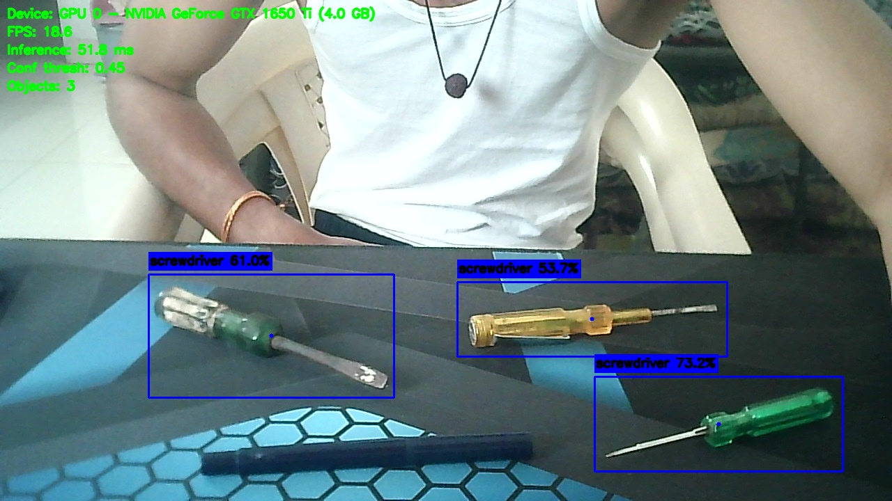

# InMoov Mechanical Tool Detector

Real-time computer-vision perception module for an InMoov humanoid robot.
Detects mechanical tools (hammer, screwdriver, pliers, wrench, spanner,
Allen key, etc.) on a workbench using a custom-trained YOLO model, from a
USB webcam mounted in the robot's eye or chest.

This is the **perception layer** for a future pick-and-place pipeline: it
outputs structured `Detection` objects (bounding box, center, area,
confidence, class) that a robot-arm controller can consume directly.

---

## 1. Project Structure

```
project/
├── config/
│   └── config.py            # All tunable settings (paths, thresholds, colors...)
├── dataset/
│   ├── data.yaml            # Class names + train/val paths (EDIT THIS)
│   ├── images/{train,val}/
│   └── labels/{train,val}/
├── models/                  # best.pt copied here after training, for inference
├── runs/                    # Ultralytics training/eval outputs (curves, weights, confusion matrix)
├── logs/                    # Rotating log files per component
├── reports/                 # Validation & evaluation text reports, snapshots
├── scripts/
│   └── validate_dataset.py  # Pre-training dataset integrity checks
├── utils/
│   ├── logger.py
│   ├── device.py             # CPU/GPU autodetection
│   └── detection.py          # Detection dataclass + drawing helpers
├── train.py
├── evaluate.py
├── webcam_detect.py
├── requirements.txt
└── README.md
```

---

## 2. Installation

Requires **Python 3.11+**.

```bash
python -m venv venv
source venv/bin/activate        # Windows: venv\Scripts\activate
pip install -r requirements.txt
```

If you have an NVIDIA GPU, install the CUDA-enabled PyTorch build from
https://pytorch.org/get-started/locally/ **before** `pip install -r
requirements.txt`, so `torch` isn't overwritten with a CPU-only wheel.

---

## 3. Dataset Placement

Your YOLOv8-format dataset must be placed like this:

```
dataset/
├── data.yaml
├── images/
│   ├── train/*.jpg
│   └── val/*.jpg
└── labels/
    ├── train/*.txt
    └── val/*.txt
```

Edit `dataset/data.yaml` and replace the `names:` list with your actual
tool classes, in the exact order used when you labeled the data:

```yaml
names:
  0: hammer
  1: screwdriver
  2: pliers
  3: wrench
  ...
```

Each label `.txt` file uses standard YOLO format — one line per object:

```
<class_id> <x_center> <y_center> <width> <height>   # all normalized 0-1
```

### Validate before training

```bash
python scripts/validate_dataset.py
```

This checks: image/label pairing, corrupted images/labels, valid class
IDs, boxes inside image bounds, empty label files, and duplicate images.
A report is written to `reports/dataset_validation_report.txt`.
`train.py` runs this automatically before every training run (skip with
`--skip-validation`).

---

## 4. Training

```bash
python train.py
```

Common overrides:

```bash
python train.py --epochs 200 --batch 32 --imgsz 640 --weights yolo11s.pt
python train.py --device cpu                # force CPU
python train.py --device 0                  # force GPU 0
python train.py --name experiment_v2        # custom run name
python train.py --resume                    # resume an interrupted run
```

Defaults (edit in `config/config.py`):

| Parameter      | Default   |
|----------------|-----------|
| Base weights   | `yolo11n.pt` (pretrained, transfer learning) |
| Epochs         | 150 |
| Batch size     | 16 |
| Image size     | 640 |
| Optimizer      | AdamW |
| Learning rate  | 0.001 |
| Early stopping | patience = 25 epochs |
| Augmentation   | mosaic, mixup, HSV jitter, flips, translate/scale |

Outputs land in `runs/detect/<name>/`:
- `weights/best.pt`, `weights/last.pt`
- `results.png` (loss/precision/recall/mAP curves)
- `confusion_matrix.png`
- `results.csv` (per-epoch metrics)

`best.pt` is automatically copied to `models/best.pt`, which is the
default weights path used by `evaluate.py` and `webcam_detect.py`.

Logs: `logs/training.log`.

---

## 5. Evaluation

```bash
python evaluate.py
python evaluate.py --weights runs/detect/tool_detector/weights/best.pt
```

Prints and saves (`reports/evaluation_report.txt`):
- Precision, Recall
- mAP50, mAP50-95
- F1 score
- Average inference time (ms/image) and FPS
- GPU memory usage (if CUDA available)
- Per-class mAP50-95 breakdown

---

## 6. Running the Webcam Detector

```bash
python webcam_detect.py
```

Options:

```bash
python webcam_detect.py --camera 1 --conf 0.5
python webcam_detect.py --weights models/best.pt --device cpu
python webcam_detect.py --no-display        # headless, logs only (for robot deployment)
```

On-screen: bounding boxes, tool name, confidence %, FPS, inference time
(ms), and active device (CPU/GPU).

**Keyboard controls** (windowed mode):
| Key | Action |
|-----|--------|
| `q` | Quit |
| `+` / `-` | Raise / lower confidence threshold live |
| `s` | Save current frame to `reports/snapshots/` |

Each detected object is materialized as a `Detection` object
(`utils/detection.py`) with:

```
class_name, class_id, confidence, xmin, ymin, xmax, ymax,
width, height, center_x, center_y, area
```

These are logged (`logs/camera.log`) and are exactly what a robot-arm /
grasp-planning module should consume next.

---

## 7. Changing the Confidence Threshold

Three ways, in order of convenience:
1. Live, while running: press `+` / `-`.
2. CLI flag: `python webcam_detect.py --conf 0.6`
3. Persistent default: edit `confidence_threshold` in `config/config.py`.

---

## 8. Changing / Upgrading the Model

- Swap the base architecture for training: `--weights yolo11s.pt` (or
  `yolo11m.pt`, `yolo11l.pt`, `yolo11x.pt` for higher accuracy at the cost
  of speed).
- Swap inference weights: `--weights path/to/other/best.pt` on
  `evaluate.py` / `webcam_detect.py`, or update `weights_path` in
  `config/config.py`.

---
## Detection Results

### Real-Time Tool Detection



## 9. Adding New Tool Classes Later

1. Add new images + YOLO-format labels for the new tool to
   `dataset/images/{train,val}` and `dataset/labels/{train,val}`.
2. Append the new class to `dataset/data.yaml` under `names:` (keep
   existing IDs stable if you also add new label files using them).
3. Re-run validation: `python scripts/validate_dataset.py`.
4. Retrain — either from scratch (`--weights yolo11n.pt`) or fine-tune
   from your current `best.pt` (`--weights models/best.pt`) for faster
   convergence when only a few images were added.

---

## 10. Retraining the Model

```bash
# Fine-tune from the existing best.pt with new/updated data
python train.py --weights models/best.pt --epochs 100 --name retrain_v2

# Or fully retrain from the pretrained backbone
python train.py --weights yolo11n.pt --epochs 150 --name retrain_from_scratch
```

---

## 11. Exporting to ONNX / TensorRT

```bash
# ONNX (portable, works with onnxruntime on CPU/GPU)
yolo export model=models/best.pt format=onnx opset=12 simplify=True dynamic=False imgsz=640

# TensorRT (NVIDIA Jetson / desktop GPU, fastest inference)
yolo export model=models/best.pt format=engine imgsz=640 half=True device=0
```

Or from Python:

```python
from ultralytics import YOLO
model = YOLO("models/best.pt")
model.export(format="onnx", opset=12, simplify=True, imgsz=640)
model.export(format="engine", imgsz=640, half=True, device=0)  # requires TensorRT + matching CUDA
```

TensorRT export must be run **on the target device** (e.g. the Jetson
that will actually run the robot) since engines are hardware/CUDA-version
specific.

---

## 12. Common Errors

| Error | Fix |
|-------|-----|
| `Could not open camera at index 0` | Check the webcam is plugged in / not in use by another app; try `--camera 1`. |
| `Weights not found at models/best.pt` | Train first (`python train.py`), or pass `--weights <path>`. |
| `data.yaml not found` | Populate `dataset/data.yaml` with your class names and paths. |
| Dataset validation FAIL | Read `reports/dataset_validation_report.txt`; it lists exact missing/corrupt files and line numbers. |
| CUDA out of memory during training | Lower `--batch`, or `--imgsz 416`. |
| Low FPS on CPU | Use a smaller model (`yolo11n.pt`), lower `--imgsz`, or export to ONNX/TensorRT. |
| `ModuleNotFoundError: ultralytics` | `pip install -r requirements.txt` inside your active venv. |

---

## 13. Future Robotics Integration

The code is modular specifically so it can be extended without rewrites:

- **ROS2 / MoveIt2**: wrap `ToolDetector.infer()` (in `webcam_detect.py`)
  in a ROS2 node; publish `Detection` objects as a custom message or
  `vision_msgs/Detection2DArray`.
- **Robot arm inverse kinematics**: `Detection.center_x/center_y` +
  a depth value (see below) give a 3D target point for IK solvers.
- **Depth camera**: replace `cv2.VideoCapture` with your depth SDK
  (RealSense, Kinect, ZED); `ToolDetector.infer()` takes any BGR `numpy`
  frame, so the rest of the pipeline is unchanged. Fuse the depth pixel
  at `(center_x, center_y)` to get real-world Z.
- **Speech recognition / LLM**: consume the printed/logged `Detection`
  list as the robot's "what do I currently see" world-state input.

No changes to `config/`, `utils/`, `train.py`, or `evaluate.py` are needed
for any of the above — only `webcam_detect.py`'s frame source and output
sink change.

---

## 14. Suggestions for Improving Accuracy

- **More data > bigger model**: aim for 150-300+ labeled instances per
  class minimum before tuning hyperparameters further.
- **Balance classes**: check `reports/dataset_validation_report.txt` and
  your `results.png` confusion matrix — heavily imbalanced classes hurt
  recall on rare tools.
- **Vary conditions**: capture training images under the robot's actual
  lighting, camera height/angle, and background clutter — not just clean
  studio shots.
- **Hard negatives**: include workbench photos with *no* tools, and
  cluttered scenes with occluded/overlapping tools.
- **Larger backbone**: try `yolo11s.pt` or `yolo11m.pt` if CPU/GPU budget
  allows — usually the single biggest accuracy lever after data quality.
- **Increase image size**: `--imgsz 960` for small tools like Allen
  keys, at the cost of speed.
- **Tune confidence/IoU**: after training, sweep `--conf` in
  `evaluate.py` to find the best precision/recall tradeoff for your use
  case (missed grasp vs. false pickup).
- **Test-time augmentation**: `model.val(..., augment=True)` for a small
  mAP bump during evaluation (not recommended for real-time webcam use —
  it's slower).

---

## 15. Command Reference (quick copy-paste)

```bash
# Install
python -m venv venv && source venv/bin/activate
pip install -r requirements.txt

# Validate dataset
python scripts/validate_dataset.py

# Train
python train.py --epochs 150 --batch 16 --imgsz 640

# Evaluate
python evaluate.py

# Run live detection
python webcam_detect.py --camera 0 --conf 0.45

# Export
yolo export model=models/best.pt format=onnx imgsz=640
```
